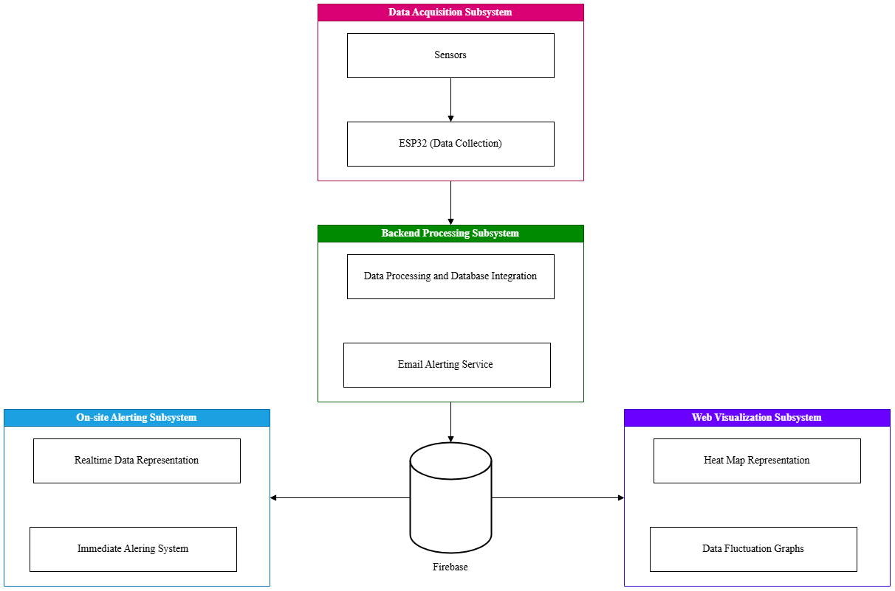

# Iot Water Safety Monitoring System


An IoT-based lake water safety monitoring system that continuously measures environmental parameters and provides real-time safety alerts, visual analytics, and on-site warnings.

The system integrates sensor nodes, cloud processing, alert mechanisms, and a web dashboard to monitor water conditions and notify users when unsafe conditions are detected.

## Overview

Water bodies used for recreation often lack real-time monitoring systems. Traditional laboratory testing methods are slow and cannot provide immediate safety insights.

- This project introduces a low-cost IoT architecture capable of:
- Collecting water quality data in real time
- Processing environmental readings
- Detecting unsafe conditions
- Sending alerts to authorities
- Providing visual insights through a dashboard
- Triggering local warnings for nearby individuals

IoT-based monitoring systems enable continuous environmental sensing and remote data analysis, making them effective for real-time water safety assessment.

## System Architecture

The system is divided into four main components:



## Firebase Database Schema

### 1. Raw Readings

- Table Name - `raw-readings`
- Purpose - To store all the raw data

| Field Name      | Type    | Description                          |
| --------------- | ------- | ------------------------------------ |
| readingId (key) | string  | Unique ID (e.g., timestamp)          |
| temperature     | float   | Temperature value from sensor        |
| turbidity       | float   | Turbidity value from sensor          |
| ambientLight    | float   | Ambient light value                  |
| timestamp       | integer | Epoch time when reading was recorded |

- Example JSON entry:

```json
{
  "raw-readings": {
    "1771941498329": {
      "temperature": 25,
      "turbidity": 3,
      "conductivity": 120,
      "ambientLight": 350,
      "timestamp": 1771941498335
    }
  }
}
```

---

### 2. Processed Results

- Table Name - `processed-results`
- Purpose - To store processed data from the raw data

| Field Name      | Type    | Description                                     |
| --------------- | ------- | ----------------------------------------------- |
| readingId (key) | string  | Same ID as raw reading                          |
| safe            | boolean | True if water is safe, false otherwise          |
| qualityScore    | integer | Arbitrary score based on all sensors            |
| message         | string  | Text message for status (e.g., “Water is safe”) |
| timestamp       | integer | Epoch time when processed                       |

- Example JSON entry:

```json
{
  "processed-results": {
    "1771941498329": {
      "safe": true,
      "qualityScore": 100,
      "message": "Water is safe",
      "timestamp": 1771941498335
    }
  }
}
```

---

### 3. Current Status

- Table Name - `current-status`
- Purpose - To represent the processed and validated data

| Field Name    | Type    | Description                |
| ------------- | ------- | -------------------------- |
| lastReadingId | string  | Latest Reading ID          |
| safe          | boolean | Current Safe Status        |
| qualityScore  | integer | Latest water quality score |
| message       | string  | Latest status message      |
| updatedAt     | integer | Epoch time of last update  |

- Example JSON entry:

```json
{
  "current-status": {
    "lastReadingId": "1771941498335",
    "safe": false,
    "qualityScore": 50,
    "message": "Turbidity exceeds safe threshold",
    "updatedAt": 1771941498335
  }
}
```

---

### 4. Alerts

- Table Name - `alerts`
- Purpose - To represent alerts and maintain states for authorized confirmation

| Field Name     | Type    | Description                                        |
| -------------- | ------- | -------------------------------------------------- |
| alertId (key)  | string  | Unique alert ID (timestamp or UUID)                |
| readingId      | string  | Linked raw/processed reading ID                    |
| type           | string  | Type of alert (e.g., “Water Unsafe”)               |
| message        | string  | Description of the alert                           |
| acknowledgedBy | string  | Authority who cleared the alert (null if active)   |
| createdAt      | integer | Epoch time alert was created                       |
| clearedAt      | integer | Epoch time alert was acknowledged (null if active) |
| currentStatus  | boolean | True → active warning, False → cleared             |
| resolveToken   | string  | Generated token for authentication                 |
| tokenExpiry    | string  | Expiration time for the generated token            |

- Example JSON entry:

```json
{
  "alerts": {
    "1771941498329": {
      "readingId": "1771941498329",
      "type": "Water Unsafe",
      "message": "Turbidity exceeds safe threshold",
      "acknowledgedBy": null,
      "createdAt": 1771941498335,
      "clearedAt": null,
      "currentStatus": true
    }
  }
}
```

## Future Improvements

- Additional sensors (pH, dissolved oxygen)
- Solar-powered sensor nodes
- Machine learning based risk prediction
- Mobile application integration
- GPS-based location heat mapping
